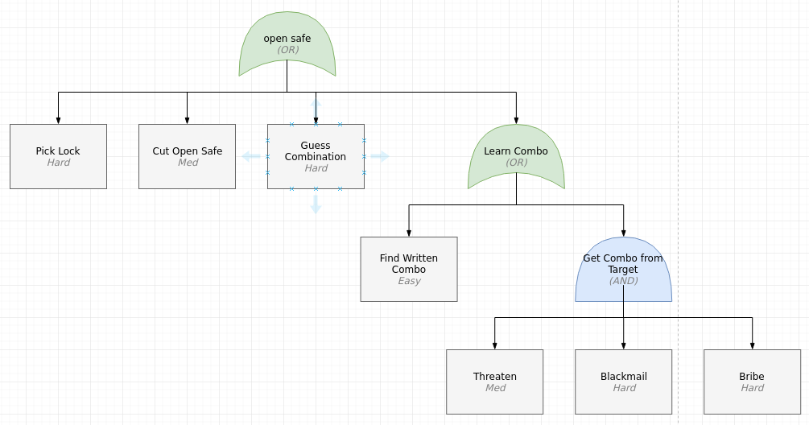
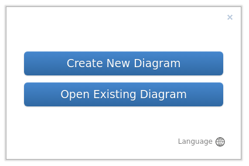
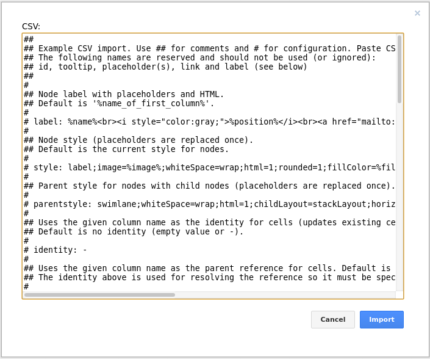

# What is this

This is a set of scripts for easily importing attack tree CSV files into draw-io. The diagram styles  use the [Draw.io libraries for threat modeling diagrams](https://github.com/michenriksen/drawio-threatmodeling) created by Michael Henriksen.



# Using This library

## Build Draw.io Docker Container

```
./run.sh build
```

## Create CSV file with your attack trees in it

Take a look at [the example attack tree csv](attack_tree.csv) to see an attack tree format.


* name: The name of the attack
* id: The id of the attack.
* parent: The id of this attack parent (if any)
* type: The type of the object [LEAF, OR, AND] AND & OR are boolean operators.
* url: A reference URL that will be available if the user clicks on an attack.
* description: A Description of the attack.
* difficulty: The level of difficulty to carry out an attack. (Does not apply to AND and OR object types)

## Create the draw.io CSV text to import

When you run this command it will print out text for you to copy into draw.io.

```
run.sh csv attack_tree.csv
```

If you want the output to go to a file so you can hand edit you can just write to a file.

```
run.sh csv attack_tree.csv > /tmp/attack_tree.csv
```

## Run docker container

```
./run.sh build
```

# Create a new graph



# Import the CSV file

1. Open the CSV import dialogue.
  * **Arrange** > **Insert** > **CSV...**

2. Copy the text created by the `run.sh csv` command.

3. Replace the default text with the copied text.



4. Modify the graph that is created.


# Styles

Styles Derived From ["Draw.io libraries for threat modeling"](https://github.com/michenriksen/drawio-threatmodeling)
**Copyright (c) 2018 Michael Henriksen, using The MIT License (MIT)**


## Attack Tree
```
LEAF: "rounded=0;whiteSpace=wrap;html=1;fillColor=#f5f5f5;strokeColor=#666666;"
OR: "shape=xor;whiteSpace=wrap;html=1;fillColor=#d5e8d4;strokeColor=#82b366;direction=north;"
AND: "shape=or;whiteSpace=wrap;html=1;direction=north;fillColor=#dae8fc;strokeColor=#6c8ebf;"
```

## Data Flow Diagrams

### NOTE: Not Implemented

```
External Entity : "rounded=0;whiteSpace=wrap;html=1;"

Process : "ellipse;whiteSpace=wrap;html=1;aspect=fixed;"

Multi-Process : "ellipse;shape=doubleEllipse;whiteSpace=wrap;html=1;aspect=fixed;"

Data Store : "shape=partialRectangle;whiteSpace=wrap;html=1;left=0;right=0;fillColor=none;"

Data Flow : "endArrow=classic;html=1;fontColor=#FF3333;"

Bidirectional Data Flow : "endArrow=classic;startArrow=classic;html=1;fontColor=#FF3333;"

Trust Boundary : "html=1;fontColor=#FF3333;fontStyle=1;align=left;verticalAlign=top;spacing=0;labelBorderColor=none;fillColor=none;dashed=1;strokeWidth=2;strokeColor=#FF3333;spacingLeft=4;spacingTop=-3;"

Trust Boundary : "shape=requiredInterface;html=1;verticalLabelPosition=bottom;dashed=1;strokeColor=#FF3333;strokeWidth=2;fillColor=none;fontColor=#FF3333;align=left;rotation=0;"

Label : "text;html=1;strokeColor=none;fillColor=none;align=center;verticalAlign=middle;whiteSpace=wrap;overflow=hidden;"

Asset Label : "text;html=1;strokeColor=#d6b656;fillColor=#fff2cc;align=center;verticalAlign=middle;whiteSpace=wrap;overflow=hidden;"

Security Control Label : "text;html=1;strokeColor=#82b366;fillColor=#d5e8d4;align=center;verticalAlign=middle;whiteSpace=wrap;overflow=hidden;"

Threat Actor Label : "text;html=1;strokeColor=#b85450;fillColor=#f8cecc;align=center;verticalAlign=middle;whiteSpace=wrap;overflow=hidden;"

Asset Table : <mxGraphModel><root><mxCell id="0"/><mxCell id="1" parent="0"/><mxCell id="2" value="&lt;table border=&quot;1&quot; width=&quot;100%&quot; style=&quot;width: 100% ; height: 100% ; border-collapse: collapse ; border: 1px solid #d6b656&quot;&gt;&lt;tbody&gt;&lt;tr style=&quot;background-color: #fff2cc ; color: #000000 ; border: 1px solid #d6b656&quot;&gt;&lt;th align=&quot;center&quot; colspan=&quot;2&quot;&gt;Assets&lt;/th&gt;&lt;/tr&gt;&lt;tr style=&quot;background-color: #fff2cc ; color: #000000 ; border: 1px solid #d6b656&quot;&gt;&lt;th align=&quot;left&quot; style=&quot;border: 1px solid #d6b656&quot;&gt;ID&lt;/th&gt;&lt;th align=&quot;left&quot; style=&quot;border: 1px solid #d6b656&quot;&gt;Description&lt;/th&gt;&lt;/tr&gt;&lt;tr&gt;&lt;td style=&quot;border: 1px solid #d6b656&quot;&gt;A01&lt;/td&gt;&lt;td style=&quot;border: 1px solid #d6b656&quot;&gt;&lt;br&gt;&lt;/td&gt;&lt;/tr&gt;&lt;/tbody&gt;&lt;/table&gt;" style="text;html=1;strokeColor=#c0c0c0;fillColor=#ffffff;overflow=fill;rounded=0;shadow=1;labelBackgroundColor=#ffffff;fontColor=#000000;align=left;" vertex="1" parent="1"><mxGeometry width="390" height="110" as="geometry"/></mxCell></root></mxGraphModel>

Threat Actor Table : <mxGraphModel><root><mxCell id="0"/><mxCell id="1" parent="0"/><mxCell id="2" value="&lt;table border=&quot;1&quot; width=&quot;100%&quot; style=&quot;width: 100% ; height: 100% ; border-collapse: collapse ; border: 1px solid #b85450&quot;&gt;&lt;tbody&gt;&lt;tr style=&quot;background-color: #f8cecc ; color: #000000 ; border: 1px solid #b85450&quot;&gt;&lt;th align=&quot;center&quot; colspan=&quot;2&quot;&gt;Threat Actors&lt;/th&gt;&lt;/tr&gt;&lt;tr style=&quot;background-color: #f8cecc ; color: #000000 ; border: 1px solid #b85450&quot;&gt;&lt;th align=&quot;left&quot; style=&quot;border: 1px solid #b85450&quot;&gt;ID&lt;/th&gt;&lt;th align=&quot;left&quot; style=&quot;border: 1px solid #b85450&quot;&gt;Description&lt;/th&gt;&lt;/tr&gt;&lt;tr&gt;&lt;td style=&quot;border: 1px solid #b85450&quot;&gt;TA01&lt;/td&gt;&lt;td style=&quot;border: 1px solid #b85450&quot;&gt;&lt;br&gt;&lt;/td&gt;&lt;/tr&gt;&lt;/tbody&gt;&lt;/table&gt;" style="text;html=1;strokeColor=#c0c0c0;fillColor=#ffffff;overflow=fill;rounded=0;shadow=1;labelBackgroundColor=#ffffff;fontColor=#000000;align=left;" vertex="1" parent="1"><mxGeometry x="2.2737367544323206e-13" width="365" height="90" as="geometry"/></mxCell></root></mxGraphModel>

Security Control Table : <mxGraphModel><root><mxCell id="0"/><mxCell id="1" parent="0"/><mxCell id="2" value="&lt;table border=&quot;1&quot; width=&quot;100%&quot; style=&quot;width: 100% ; height: 100% ; border-collapse: collapse ; border: 1px solid #82b366&quot;&gt;&lt;tbody&gt;&lt;tr style=&quot;background-color: #d5e8d4 ; color: #000000 ; border: 1px solid #82b366&quot;&gt;&lt;th align=&quot;center&quot; colspan=&quot;2&quot;&gt;Security Controls&lt;/th&gt;&lt;/tr&gt;&lt;tr style=&quot;background-color: #d5e8d4 ; color: #000000 ; border: 1px solid #82b366&quot;&gt;&lt;th align=&quot;left&quot; style=&quot;border: 1px solid #82b366&quot;&gt;ID&lt;/th&gt;&lt;th align=&quot;left&quot; style=&quot;border: 1px solid #82b366&quot;&gt;Description&lt;/th&gt;&lt;/tr&gt;&lt;tr&gt;&lt;td style=&quot;border: 1px solid #82b366&quot;&gt;C01&lt;/td&gt;&lt;td style=&quot;border: 1px solid #82b366&quot;&gt;&lt;br&gt;&lt;/td&gt;&lt;/tr&gt;&lt;/tbody&gt;&lt;/table&gt;" style="text;html=1;strokeColor=#c0c0c0;fillColor=#ffffff;overflow=fill;rounded=0;shadow=1;labelBackgroundColor=#ffffff;fontColor=#000000;align=left;" vertex="1" parent="1"><mxGeometry x="2.2737367544323206e-13" width="360" height="100" as="geometry"/></mxCell></root></mxGraphModel>

Note : "shape=note;strokeWidth=2;fontSize=14;size=20;whiteSpace=wrap;html=1;fillColor=#fff2cc;strokeColor=#d6b656;fontColor=#666600;"
```
